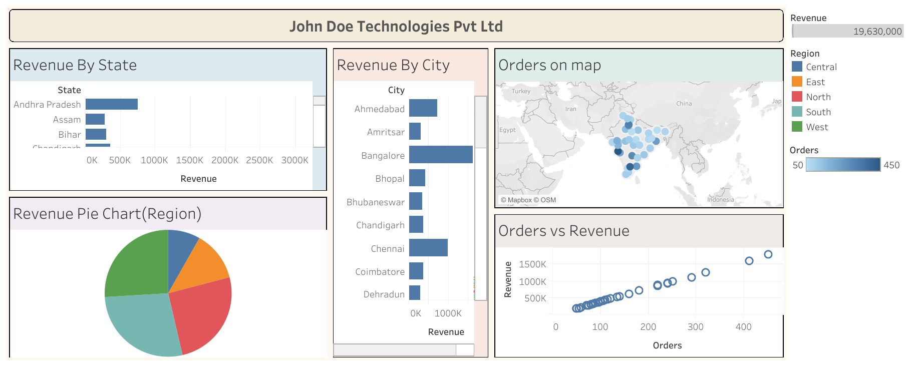

# 📊 John Doe Technologies Pvt Ltd – Tableau Dashboard

An interactive **Tableau dashboard** designed to analyze sales performance, revenue distribution, and order trends for **John Doe Technologies Pvt Ltd**.

The dashboard provides a clear view of revenue and order performance across different **states, cities, and regions**, along with a geographical representation of orders across India.

---

## 🔗 Project Links

### 📈 Live Tableau Dashboard
[View Interactive Dashboard on Tableau Public](https://public.tableau.com/shared/TN76CS4JD?:display_count=n&:origin=viz_share_link)

### 💻 GitHub Repository
[View Source Code & Project Files](https://github.com/bushramujahid/John-Doe-Technologies-Pvt-Ltd-Tableau-Dashboard)

---

## 🖼️ Dashboard Preview



---

## 📌 Project Overview

The **John Doe Technologies Pvt Ltd Dashboard** transforms sales data into an interactive business intelligence dashboard using Tableau.

The dashboard focuses on:

- Revenue performance
- Order distribution
- Regional analysis
- State-wise revenue
- City-wise revenue
- Geographical order distribution
- Relationship between orders and revenue

The objective is to provide an easy-to-understand visual representation of business performance and help identify areas contributing to revenue and order volume.

---

## 📊 Dashboard Features

### 1. 💰 Revenue by State

A horizontal bar chart showing revenue generated across different states.

This visualization helps identify:

- High-revenue states
- Low-performing states
- Differences in revenue contribution across locations

---

### 2. 🏙️ Revenue by City

A city-level revenue comparison showing how different cities contribute to overall revenue.

The dashboard includes cities such as:

- Ahmedabad
- Amritsar
- Bangalore
- Bhopal
- Bhubaneswar
- Chandigarh
- Chennai
- Coimbatore
- Dehradun

---

### 3. 🌍 Orders on Map

A geographical visualization displaying order distribution across India.

The map uses different circle sizes to represent order volume, making it easier to identify locations with higher concentrations of orders.

---

### 4. 🥧 Revenue by Region

A pie chart showing the distribution of revenue across the five regions:

- Central
- East
- North
- South
- West

This provides a quick overview of regional revenue contribution.

---

### 5. 📈 Orders vs Revenue

A scatter plot showing the relationship between:

- **Orders**
- **Revenue**

This visualization helps understand whether higher order volumes are associated with higher revenue.

---

### 6. 🎛️ Interactive Filters

The dashboard includes interactive controls that allow users to explore the data based on:

- Revenue
- Region
- Orders

Users can interact with the dashboard to focus on specific segments of the business.

---

## 💡 Key Dashboard Metrics

The dashboard provides an overall revenue view, with the displayed dashboard showing approximately:

**Total Revenue: 19.63M**

The dashboard can be interactively filtered to explore the underlying revenue and order distribution.

---

## 🛠️ Tools & Technologies

| Tool | Purpose |
|------|---------|
| **Tableau Public** | Data visualization & dashboard development |
| **CSV** | Source data |
| **Tableau Workbook (.twb)** | Dashboard structure and visualizations |
| **GitHub** | Project version control and documentation |

---

## 📂 Project Structure

```text
John-Doe-Technologies-Pvt-Ltd-Tableau-Dashboard/
│
├── 📊 John Doe Technologies Pvt Ltd Dashboard.twb
├── 📄 data.csv
├── 🖼️ Summary.png
├── 📖 README.md
└── ⚙️ .gitattributes

